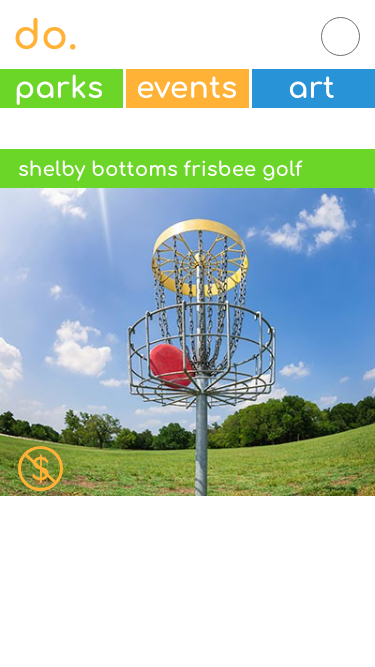
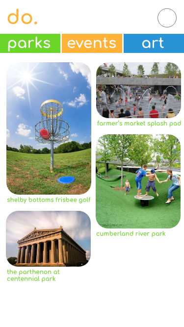

Day Out, or do., is a Tinder style app that allows users to "match" with new points of interest in the Nashville area. Using data from data.nashville.gov, do. pulls from Nashville's Public Art, Historical Markers, and Parks data. 

# our user.

We call our user the "Impoverished Influencer." Think millennial, think hipster, think school debt. Bryan, is the kind of guy that wants to be on top of the game when it comes to the next cool thing to do. He’s is looking to find interesting new ways to break his routine - and if they’re free, all the better. He’s already an outdoor exerciser, he takes his dog to the dog park, our goal is to expand on his behaviour and let him know what else there is to do. in  his area. 

# the process.
Our original prototype was a scroll based version of the final app with differentiation between Art, Parks, and Historical Data. Upon user testing, we realized the desired outcome for the user was to quickly find things near them when they were already out, or when they were ready to go out. We found out the user wanted something quick, relatable, and fun when dealing with this data.  From this place we pivoted to the Tinder style which more captivated users. 
 
 
the original. 

 
 
the pinterest pivot. 

 
 
the locator. 

 
 

the final.

# MVP goals.
1. Authenticate user with Google Auth
1. Store user data to Firebase
1. User can view points of interest including Public Art data, Historical Marker data, and Park data as a Tinder-style card
1. On card image click the user will be able to view details of the location.
1. On details page the user can leave a comment about the location
1. From card view, the user can "match" with data and save it to associate with their user data - then next POI shows
1. User can pass on data and next POI shows
1. User can swipe to quickly pass through cards
1. User can view a profile to see their Google user image, set their radius, and view their matches

# stretch goals.
1. Include Google Maps API to show location of POI on maps
1. When set in profile, the user can select to only see matches in ~1 mile, ~5 miles, ~10 miles
1. Return to last card button functionality
1. Images for parks and history, most ideally supported by Nashville Open Data API

# how to view this app.
1. Clone the do. repository
1. npm install to get your node_modules up and kickin' (they're gonna make this work)
1. run 'npx styleguidist server' from your terminal to view our component style guide 
1. run 'npm start' from your terminal to to view the project from your local server
1. happy hacking! 

# technologies.
1. Hammer.js - used for card swiping.
1. react-geolocated 
1. geolib
1. Bootstrap
1. Styleguidist
1. Rebase